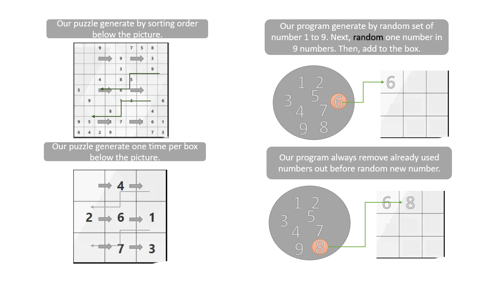

# Sudoku-Game

*Contents*
- [Description of application](#description-of-application)
- [Details of application](#details-of-application)
- [Game Features](#game-features)
- [Installation](#installation)
- [Technology and Knowledge](#technology-and-knowledge)
- [Contributors](#contributors)

## Description of application

Sudoku Game application is an application puzzle game designed for a single player that composing the grid contains all of the digits from 1 to 9 or 16. The puzzle setter provides a partially completed grid, which for a well-posed puzzle has a single solution.

## Details of application

The application lets players input name and choose mode, size, and difficulty then start the game. In the game, a player must place numbers in the correct squares as soon as possible. After player finished the game, score table will be display the player’s name, rank of player’s time, and choices for players (play again or main menu).

## Game Features

### Game System
Sudoku Game has 2 modes which are ‘Basic-Sudoku’ and ‘Greater than Sudoku’.

- Basic-Sudoku is a normally Sudoku game which has 2 levels (easy and hard). Also, Sudoku game can select 3X3 table or 4X4 table.

- Greater than Sudoku has additional rule where border between two squares is used to give a hint as to which neighbor is larger than the other. It has a pointer towards the smaller of the two numbers.

 

- 'Time system' and 'Scoreboard system' to record the time for each player use to solve the puzzle. Moreover, the application can record seperate scores for each game mode.  

- User can input name(max 9 characters) to record into scoreboard.

- User can select difficulty and size of board whatever user would like to play.

 

### Gameplay 
- User can `Right mouse click` on the box to lock a number(if user's sure in answer).
- Click `Clear` button to clear all numbers in every boxes which weren't lock.
- Click `Restart` button to play a new game with latest option.
- Click `Main menu` button to turn back to main menu.
- Click `Hint` button to hint a random number and plus 25 seconds(limit 9 times for 3x3 puzzle and 16 times for 4x4 puzzle).
- Click `Done` button to commit the answer and record user's score.

### Packages
- **application** — Contains important class for this program with .fxml class.
- **logic** — Contains logic class which using to generate puzzle.
- **source** — Contains some pictures with .jpg and .png files for using in GUI.
- **strategy** — Contains class with strategy pattern for preparation the puzzle.
- **test** — Contains some class with JUnit test to check that logic of program works correctly before doing GUI, and contains some class to make dummy data in console.

## Installation
This program runs on Java 8.

#### How to Run
- Download the latest release of this program.
- Open Java text editor.
- Create Java project and include JAR file in dist folder.
- Runs the program.

- Or you can use JAR file in dist folder in our project.

## Technology and Knowledge
#### Patterns
There are some patterns that had use in this program.

- **Model-View-Controller Pattern** — Separate the responsibility for control, model and view for GUI.
- **Singleton Pattern** — Use all same object for the same class in the program.
- **Strategy Pattern** - Create objects which represent various strategies and a context object.

#### Interesting logic

In our games, all numbers are generated by such logic as...

#### Programs
##### Scene Builder
SceneBuilder is an application where you can drag and drop JavaFX UI components, and then tell your JavaFX program to use the fxml file(s) to display the user interface. So, it is so easy to use and to spend less time for user interface. 

## Contributors
- [**Kornphon Noiprasert**](https://github.com/Driveiei) [6010545021]

- [**Vichakorn Yotboonrueang**](https://github.com/Newaz2542) [6010545889]

`Note` This project created by two students in Software and Knowledge Engineering program, which this application is final project as part of Programming II course for second semester of Kasetsart University.
